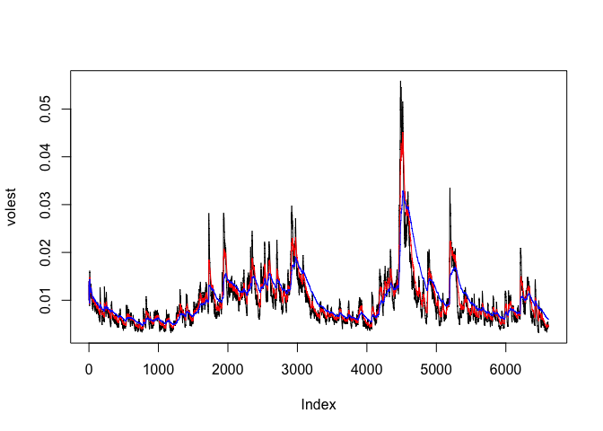

Homework11
================
Michael Crowder
3/30/2017

#### If you don't already have the "tseries" package installed please install the package with the following R code:

``` r
#install.packages("tseries")
```

#### Now activate the library

``` r
library(tseries)
```

### S&P 500 (^GSPC)

### SNP - SNP Real Time Price. Currency in USD

#### TODO: Download the data of SP500 '^gspc'.

``` r
SNPdata <- get.hist.quote('^gspc',quote="Close")
```

#### TODO: Calculate the log returns, which is the subtractration of log(lag(SNPdata)) and log(SNPdata)

``` r
SNPret <- log(lag(SNPdata)) - log(SNPdata)
```

#### TODO: Calculate volatility measure that is to multiply sd(SNPret),sqrt(250), 100

``` r
SNPvol <- sd(SNPret) * sqrt(250) * 100
```

#### Define getVol function for volatility

``` r
getVol <- function(d, logrets) {
  var = 0
  lam = 0
  varlist <- c()
  
  for (r in logrets) {
    lam = lam*(1 - 1/d) + 1
    var = (1 - 1/lam)*var + (1/lam)*r^2
    varlist <- c(varlist, var)
  }
  
  sqrt(varlist)
}
```

### Calculate volatility over entire length of series for various three different decay factors: 10 30. 100

#### TODO: call getVol function with the parameters: 10,SNPret

``` r
volest <- getVol(10, SNPret)
```

#### TODO: call getVol function with the parameters: 30,SNPret

``` r
volest2 <- getVol(30, SNPret)
```

#### TODO: call getVol function with the parameters: 100,SNPret

``` r
volest3 <- getVol(100, SNPret)
```

#### Plot the results, overlaying the volatility curves on the data, just as was done in the S&P example.

``` r
plot(volest,type="l")
lines(volest2, type="l",col="red")
lines(volest3, type="l",col="blue")
```


